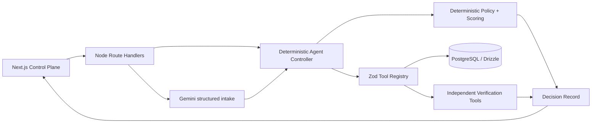

# ResolveX

**Explainable Autonomous E-Commerce Operations Agent**

ResolveX is a genuinely agentic operations platform. It investigates commerce incidents through typed tools, evaluates policy-constrained alternatives with a deterministic scoring engine, executes real sandbox operations, verifies the resulting state independently, and seals every outcome in a contestable Decision Record.

> Demo mode is deterministic, clearly labelled, and requires no model key. All bundled people, orders, messages, payments, and events are synthetic.

## Why it is agentic

The controller completes a closed loop: **Observe → Plan → Act → Verify → Recover or Complete → Explain**. The model can classify, plan, and propose candidates; it cannot mutate arbitrary data. Consequential state changes pass through a Zod-validated permissioned tool registry with idempotency keys, bounded retries, audit events, and separate verification tools.

## Why its explanations are trustworthy

ResolveX never exposes hidden chain-of-thought. It produces a structured Decision Record from observable material: evidence IDs, source records, exact policy clauses, candidate scores, factor contributions, rejection reasons, tool inputs and receipts, verification results, counterfactual reruns, and version identifiers. The “Ask About This Decision” panel retrieves only from that stored record.

## Product surface

- Cinematic landing experience and executive command plane
- Ranked support queue and end-to-end live agent run
- Manual-input workflow with Gemini structured extraction, editable evidence review, and streamed execution
- Decision Studio with evidence, policies, candidates, factor attribution, counterfactuals, tool receipts, verification, interrogation, and JSON export
- Constrained operations optimizer with global budget and inventory allocation
- Human approval queue with approve, reject, modify, operator notes, and resume attribution
- Searchable dual-form policy library
- Agency and explainability benchmark center with 40 deterministic scenarios
- Versioned autonomy thresholds and visible scoring weights
- PostgreSQL/Drizzle production schema plus no-key sandbox fallback

## Architecture



## Quick start

Requirements: Node.js 20.19+ (Node 22 recommended), npm 10+, and optionally Docker Desktop for PostgreSQL.

```bash
npm install
copy .env.example .env.local
npm run dev
```

Open `http://localhost:3000`, then select **Launch the live case**. The demo account is implicit in sandbox mode; no credentials are required.

### Full local PostgreSQL path

```bash
docker compose up -d
npm run db:generate
npm run db:migrate
npm run data:generate
npm run db:seed
```

### Validation

```bash
npm run typecheck
npm run lint
npm run test
npm run evaluate
npm run build
npx playwright install chromium
npm run test:e2e
```

## Environment variables

| Variable                    |   Required | Purpose                                                                        |
| --------------------------- | ---------: | ------------------------------------------------------------------------------ |
| `DATABASE_URL`              | Production | PostgreSQL connection string; local UI falls back to transparent sandbox state |
| `GEMINI_API_KEY`            |         No | Server-only language extraction; manual structured entry is the fallback       |
| `GEMINI_MODEL`              |         No | Intake model; defaults to `gemini-3.5-flash`                                   |
| `APP_URL`                   | Production | Canonical deployment URL                                                       |
| `DEMO_MODE`                 |         No | Enables deterministic synthetic demo data                                      |
| `AUTONOMY_LEVEL`            |         No | `recommend`, `low-risk`, `bounded`, or `sandbox`                               |
| `MAX_AUTONOMOUS_REFUND_INR` |         No | Financial approval boundary                                                    |
| `MAX_BATCH_BUDGET_INR`      |         No | Batch confirmation boundary                                                    |

## Vercel deployment

1. Import `Arawal123/resolvex-agentic-commerce` in Vercel.
2. Select **Next.js**; root directory is the repository root.
3. Use Node.js **22.x**, Install Command `npm ci`, Build Command `npm run build`, and Output Directory **Next.js default**.
4. Provision Neon, Supabase Postgres, or Vercel Marketplace Postgres. Add `DATABASE_URL` to Production, Preview, and Development.
5. Add `APP_URL`, `DEMO_MODE=true`, `AUTONOMY_LEVEL=bounded`, monetary limits, and optionally the server-only `GEMINI_API_KEY` and `GEMINI_MODEL`.
6. Run migrations against production before promotion: `npm run db:migrate`; seed only the hackathon/demo environment.
7. Deploy. `/api/health` should return `status: healthy`.

Every pull request receives a Vercel preview when Git integration is enabled. See [docs/DEPLOYMENT.md](docs/DEPLOYMENT.md) for the complete specification, rollout, and rollback procedure.

## Repository map

```text
src/app              routes, pages, and server-side APIs
src/components       cinematic product scenes and interactive workflows
src/lib/agent        closed-loop controller and decision interrogation
src/lib/tools        typed read, write, and verification tool registry
src/lib/decision     scoring, validation, and counterfactual reruns
src/lib/optimization constrained batch allocation
src/lib/db           Drizzle PostgreSQL schema and lazy connection
scripts              generation, seeding, reset, import, evaluation
tests / e2e          unit, integration, and browser journeys
docs                 architecture, safety, evaluation, dataset, deploy
```

## Documentation

- [Architecture](docs/ARCHITECTURE.md)
- [Agent design](docs/AGENT_DESIGN.md)
- [Explainability](docs/EXPLAINABILITY.md)
- [Evaluation](docs/EVALUATION.md)
- [Dataset](docs/DATASET.md)
- [Deployment](docs/DEPLOYMENT.md)
- [Guided demo](docs/DEMO_SCRIPT.md)
- [Security](docs/SECURITY.md)
- [Contributing](CONTRIBUTING.md)

## Limitations

The bundled operational integrations are deterministic sandbox adapters. Production deployments should replace them with authenticated order-management, payment, warehouse, courier, and messaging connectors while retaining the same typed permission boundary. The local memory fallback is intentionally ephemeral; production writes require PostgreSQL.

## Suggested GitHub topics

`agentic-ai` · `explainable-ai` · `nextjs` · `gemini` · `ecommerce` · `operations` · `drizzle` · `vercel`

Licensed under the MIT License.
