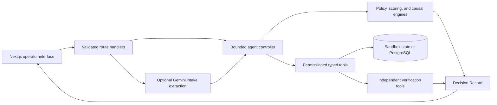

# ResolveX

**Explainable Autonomous E-Commerce Operations Agent**

> [!IMPORTANT]
> **Judges should run ResolveX locally for the complete experience.** The hosted build is useful as a visual preview, but the full agent run, streamed tool activity, manual case intake, counterfactual testing, local persistence, and environment-dependent integrations should be evaluated from the downloaded ZIP on a local machine.

## Run locally from the ZIP — start here

### 1. Install the prerequisites

Required:

- [Node.js](https://nodejs.org/) **20.19 or newer**; Node.js 22 LTS is recommended
- npm 10 or newer, included with Node.js
- A modern browser such as Chrome, Edge, or Firefox

Optional:

- [Docker Desktop](https://www.docker.com/products/docker-desktop/) for persistent local PostgreSQL data
- A Gemini API key for AI-assisted extraction from free-form customer messages

Neither Docker nor a Gemini key is required for the deterministic judge demo.

### 2. Download and extract the project

1. Open the GitHub repository.
2. Select **Code → Download ZIP**.
3. Extract the ZIP completely.
4. Open a terminal inside the extracted folder that contains `package.json`.

The extracted directory will usually be named `resolvex-agentic-commerce-main`.

### 3. Install the exact project dependencies

```bash
npm ci
```

### 4. Start ResolveX

```bash
npm run dev
```

Wait until the terminal reports that the application is ready, then open:

**[http://localhost:3000](http://localhost:3000)**

No login is required. The default local run uses synthetic sandbox data and does not need an `.env.local` file.

### 5. Run the recommended judge journey

1. On the landing page, select **Launch the live case**.
2. Open the highlighted delayed-delivery case and select **Run agent**.
3. Watch the streamed **Observe → Diagnose → Plan → Act → Verify → Explain** lifecycle.
4. Compare the two coordinated outcomes:
   - the supply-side root cause and corrective action;
   - the customer-side remedy and expected result.
5. Open **Decision Studio**.
6. Inspect root-cause probabilities, remedy-selection probabilities, evidence, tool receipts, and independent verification results.
7. Expand the audit section and test both supply and customer counterfactuals.
8. Ask the sealed record a question such as **“What went wrong on the supply side?”**
9. Visit **Operations**, **Human Oversight**, **Policies**, and **Evaluation Center** to inspect the remaining agent controls.

### 6. Stop the project

Return to the terminal and press `Ctrl+C`.

## Enable the complete local integrations

The zero-configuration sandbox above demonstrates the complete agent loop. The following optional local services add durable data and model-assisted intake.

### Persistent PostgreSQL data

Create the local environment file.

Windows PowerShell:

```powershell
Copy-Item .env.example .env.local
```

macOS or Linux:

```bash
cp .env.example .env.local
```

Start PostgreSQL and prepare the schema:

```bash
docker compose up -d
npm run db:migrate
npm run data:generate
npm run db:seed
npm run dev
```

The example database connection is already configured for the included Docker Compose service. PostgreSQL preserves manual cases and Decision Records between local server restarts. Without it, ResolveX transparently uses ephemeral in-memory sandbox state.

### Gemini-assisted manual intake

Gemini is used only to convert an unstructured customer message into a typed draft for human review. It does **not** receive permission to execute tools, issue refunds, change inventory, or bypass policy.

1. If PostgreSQL is enabled, add the key to the `.env.local` file created above. If PostgreSQL is not enabled, create `.env.local` with only the variables shown below so the application continues to use its sandbox data.
2. Add the key only to your private local file:

   ```dotenv
   GEMINI_API_KEY=your_private_key_here
   GEMINI_MODEL=gemini-3.5-flash
   ```

3. Restart `npm run dev` after changing environment variables.
4. Open **Manual Intake**, paste a customer message, review every extracted field, and submit the case.

> [!CAUTION]
> Never place a real Gemini key in `.env.example`, source code, screenshots, commits, or the ZIP. `.env.local` is ignored by Git. If no key is supplied, the same workflow remains available through the structured manual-entry fallback.

### Confirm the active local mode

Open [http://localhost:3000/api/health](http://localhost:3000/api/health). The response identifies whether ResolveX is using PostgreSQL or the sandbox fallback and whether Gemini or manual intake is active.

## What ResolveX does

ResolveX handles e-commerce incidents such as delayed deliveries, damaged or incorrect products, lost shipments, return requests, stock failures, duplicate charges, and failed deliveries. It does more than generate a recommendation: it investigates the case, chooses bounded actions, operates through permissioned tools, verifies the resulting state, and produces an auditable explanation.

### The agentic AI operating loop

| Phase                   | What the agent does                                                                                                                                                                                                                      | What the operator can inspect                                                                    |
| ----------------------- | ---------------------------------------------------------------------------------------------------------------------------------------------------------------------------------------------------------------------------------------- | ------------------------------------------------------------------------------------------------ |
| **Observe**             | Selects the incident playbook and retrieves only the customer, order, payment, inventory, tracking, and case-history facts needed for that incident.                                                                                     | Source-bound evidence IDs and read-tool receipts.                                                |
| **Diagnose**            | Reconstructs the supply path and ranks supported causes such as warehouse handling, inventory allocation, line-haul delay, last-mile failure, or no attributable supply fault.                                                           | Supply metrics, thresholds, causal path, hypotheses, confidence, and uncertainty.                |
| **Plan**                | Generates customer remedies and supply corrections, rejects invalid actions, checks policy and approval boundaries, and ranks the valid alternatives.                                                                                    | Every candidate, rejection reason, utility score, factor contribution, and selected action.      |
| **Act**                 | Executes the selected bounded operation through typed tools—for example reserving a replacement, issuing an eligible refund, creating a coupon, opening a courier investigation, notifying the customer, or opening a supply correction. | Validated inputs, permissions, idempotency keys, outputs, timestamps, and tool receipts.         |
| **Verify**              | Uses separate read-back tools to confirm that every consequential write actually changed operational state. A successful API call is not treated as proof.                                                                               | Independent verification checks and pass/fail evidence.                                          |
| **Recover or escalate** | Retries bounded transient failures, selects a valid fallback, or pauses at a human approval boundary when risk, cost, confidence, or missing evidence makes autonomous execution unsafe.                                                 | Approval reason, reviewer decision, operator note, retry/fallback event, and resume attribution. |
| **Explain**             | Seals the facts, policies, alternatives, actions, and verification results into a versioned Decision Record.                                                                                                                             | Decision Studio, grounded questions, JSON export, and deterministic counterfactual reruns.       |

### Two coordinated decisions from one investigation

ResolveX deliberately separates two questions that ordinary support automation often mixes together:

1. **What failed operationally?** The supply lane identifies the most supportable root cause and selects a corrective operational action.
2. **What is the safest useful customer remedy?** The customer lane selects the policy-valid action that best satisfies the customer goal while respecting inventory, cost, risk, and approval limits.

The two lanes share evidence but have separate candidates, execution states, and verification receipts. This allows the system to help the customer immediately without hiding the operational failure that caused the incident.

## Major product functions

### Live agent case handling

Runs a selected ticket through the complete controller and streams every phase, tool call, approval event, and verification result to the interface in real time.

### Manual case intake

Accepts a new customer message, optionally uses Gemini to extract typed facts, highlights missing or uncertain fields, requires operator review, and creates a case only after the structured data passes validation.

### Deterministic policy and remedy selection

Evaluates replacements, refunds, compensation, investigations, monitoring, and human escalation against versioned commerce policy. The final score is reproducible from stored factors such as customer-goal fit, policy compliance, SLA recovery, speed, inventory, risk, cost, complexity, and approval requirements.

### Supply root-cause diagnosis

Builds a stage-by-stage operational trace, compares observed metrics with expected thresholds, ranks causal hypotheses, and chooses a bounded correction or human supply escalation when attribution is inconclusive.

### Typed operational tools

All reads and writes pass through a Zod-validated registry with role permissions, structured results, audit IDs, explicit failure codes, bounded retries, and idempotency protection. The AI cannot emit arbitrary SQL or directly mutate application state.

### Independent verification

After actions execute, separate verification tools read the resulting state—for example replacement reservation, refund submission, coupon activation, customer notification, follow-up scheduling, supply correction, and ticket resolution.

### Decision Studio

Provides a contestable record of the outcome: evidence sources, causal hypotheses, customer and supply candidates, probabilities, exact actions, tool receipts, verification, uncertainty, policy/scoring/controller versions, and downloadable JSON.

### Grounded interrogation

The **Ask the sealed record** interface answers only from stored evidence and receipts. It does not expose or invent hidden chain-of-thought.

### Counterfactual testing

Judges can change controlled facts, such as replacement inventory or a supply metric, and rerun the same deterministic policy and scoring logic to see whether the decision boundary changes.

### Human oversight

High-value, low-confidence, conflicting, or risky actions pause for an attributed operator decision. Reviewers can approve, reject, modify, add notes, and resume the original run without losing its audit trail.

### Operations optimizer

Allocates constrained inventory and budget across multiple cases, exposes the proposed allocation and trade-offs, and requires confirmation before the sandbox batch executes.

### Evaluation Center

Runs deterministic agency and explainability scenarios and produces machine-readable results so behavior can be compared across controller, policy, and scoring versions.

## Why the system is trustworthy

ResolveX separates probabilistic language understanding from deterministic authority:

- Gemini is optional and limited to free-text intake extraction.
- Critical facts must be explicit or reviewed; unsupported values are not invented.
- Policy eligibility, utility, approval thresholds, budgets, inventory, execution, verification, and counterfactuals are deterministic TypeScript.
- Consequential actions are available only through permissioned, typed tools.
- Every action has a receipt, and every write is checked through an independent read path.
- Explanations are assembled from the stored Decision Record, not hidden model reasoning.
- All bundled customers, orders, payments, messages, and events are synthetic.

## Architecture



## Environment variables

| Variable                    | Required   | Purpose                                                                                    |
| --------------------------- | ---------- | ------------------------------------------------------------------------------------------ |
| `DATABASE_URL`              | No         | Enables PostgreSQL persistence; omit it for ephemeral sandbox state.                       |
| `GEMINI_API_KEY`            | No         | Server-only key for free-text intake extraction; never expose it client-side or commit it. |
| `GEMINI_MODEL`              | No         | Intake model; defaults to `gemini-3.5-flash`.                                              |
| `APP_URL`                   | No locally | Canonical application URL; the example uses `http://localhost:3000`.                       |
| `DEMO_MODE`                 | No         | Enables deterministic synthetic demo behavior.                                             |
| `AUTONOMY_LEVEL`            | No         | Autonomy boundary: `recommend`, `low-risk`, `bounded`, or `sandbox`.                       |
| `MAX_AUTONOMOUS_REFUND_INR` | No         | Maximum refund allowed without human approval.                                             |
| `MAX_BATCH_BUDGET_INR`      | No         | Maximum optimizer batch budget before confirmation.                                        |
| `AGENT_MAX_STEPS`           | No         | Maximum controller steps in a run.                                                         |
| `AGENT_MAX_RETRIES`         | No         | Maximum bounded retry count.                                                               |

## Validate the project locally

```bash
npm run typecheck
npm run lint
npm run test
npm run evaluate
npm run build
npx playwright install chromium
npm run test:e2e
```

## Repository map

```text
src/app              pages, layouts, and server-side API routes
src/components       interactive product scenes and workflows
src/lib/agent        controller, playbooks, and grounded interrogation
src/lib/tools        typed read, write, and verification tool registry
src/lib/decision     candidate scoring and counterfactual reruns
src/lib/supply       supply tracing, diagnosis, and corrective selection
src/lib/optimization constrained batch allocation
src/lib/db           Drizzle PostgreSQL schema and lazy connection
scripts              data generation, seeding, reset, import, and evaluation
tests / e2e          unit, integration, and browser journeys
docs                 architecture, safety, evaluation, dataset, and deployment
```

## Additional documentation

- [Architecture](docs/ARCHITECTURE.md)
- [Agent design](docs/AGENT_DESIGN.md)
- [Explainability](docs/EXPLAINABILITY.md)
- [Evaluation](docs/EVALUATION.md)
- [Dataset](docs/DATASET.md)
- [Deployment](docs/DEPLOYMENT.md)
- [Guided demo](docs/DEMO_SCRIPT.md)
- [Security](docs/SECURITY.md)
- [Contributing](CONTRIBUTING.md)

## Production limitation

The bundled write integrations are deterministic sandbox adapters. A production deployment should replace them with authenticated order-management, payment, warehouse, courier, and messaging connectors while retaining the same typed permission and verification boundaries.

Licensed under the MIT License.
