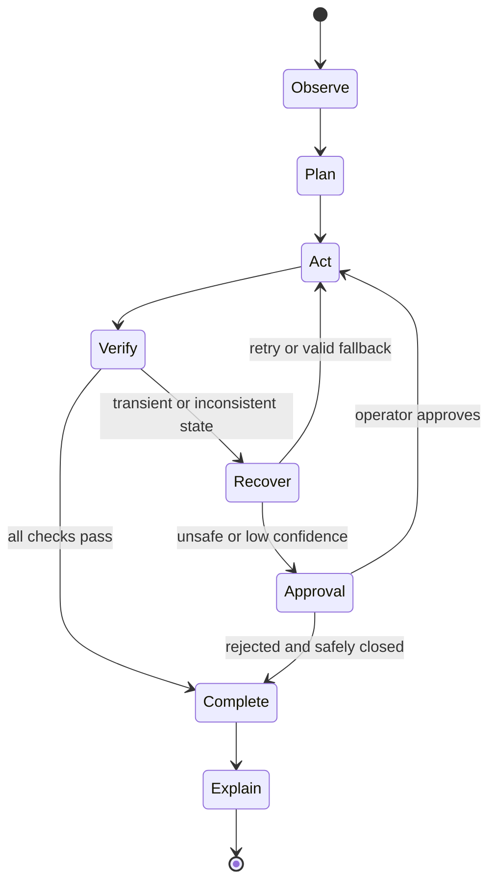
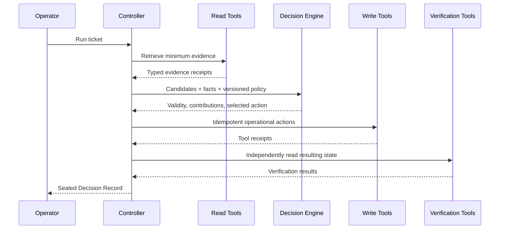
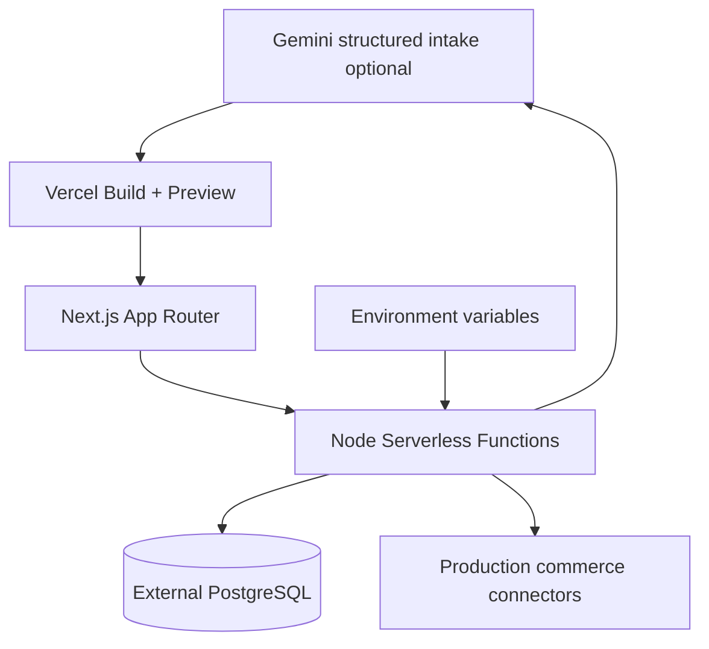

# Architecture

ResolveX separates probabilistic understanding from deterministic authority. Route handlers validate external input, the controller coordinates a bounded state machine, policy and decision engines compute permissions and utility, and tools alone may change operational state.

The PostgreSQL schema includes tickets, evidence, policy versions/rules, candidates, contributions, tool calls/results, execution attempts, verification, counterfactuals, approvals, refunds, replacements, coupons, optimizer allocations, evaluation results, and audit events. All clients are initialized lazily so `next build` never requires runtime secrets.

## Vercel deployment architecture

