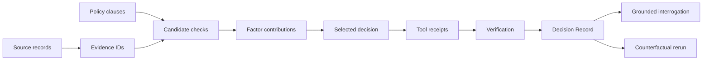

# Explainability

A Decision Record is the product’s explanation primitive. It stores the customer goal, incident class, evidence, exact source address, policy checks, candidates, factor contributions, rejection reasons, selected action, confidence, uncertainty, tool receipts, verification, timeline, approval status, and controller/policy/scoring/model versions.

No screen labels generated prose as internal reasoning. Interrogation is retrieval over a selected stored record. Counterfactuals modify controlled inputs and rerun the same policy and scoring code, showing changed contributions and newly triggered clauses. The score is reproducible by summing stored factor contributions under the recorded weight version.
